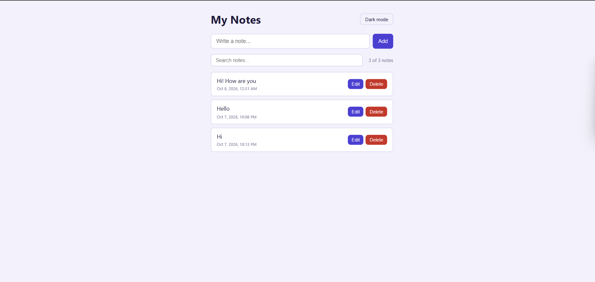

# Syntecxhub_Notes_App

A simple and clean notes app built with **React** as part of the **Syntecxhub Web Development Virtual Internship**. You can add, edit and delete notes, and they stay saved even after you refresh the page.

## Screenshot



## Live Demo

[View the app](https://syntecxhub-notes-app-six.vercel.app)

## Features

- Add, edit and move notes to Trash (with restore and delete forever)
- Pin important notes to keep them on top
- Tags (Work, Study, Personal, Ideas) with sidebar filtering
- Search across note titles and content
- Created date shown on each note
- Light and dark mode (remembered after refresh)
- Notes saved in the browser using localStorage
- Responsive layout for mobile and desktop

## React Concepts Used

| Concept | Where it is used |
|---|---|
| `useState` | Manages the notes list, input text, search text and theme |
| `useRef` | Focuses the input field on load and after add or edit |
| `useEffect` | Saves notes and theme to localStorage, and applies the theme |
| `localStorage` | Keeps notes and theme across sessions |
| `useMemo` | Calculates the filtered notes and sidebar counts only when needed |
| `useCallback` | Keeps handler functions stable so note cards don't re-render |

## Tech Stack

- React
- Vite
- CSS (custom properties for light and dark themes)

## Run Locally

```bash
git clone https://github.com/sumlamusthafa/Syntecxhub_Notes_App.git
cd Syntecxhub_Notes_App
npm install
npm run dev
```

Then open `http://localhost:5173` in your browser.

## Author

**MM Fathima Sumla**
Web Development Intern at [Syntecxhub](https://www.syntecxhub.com)